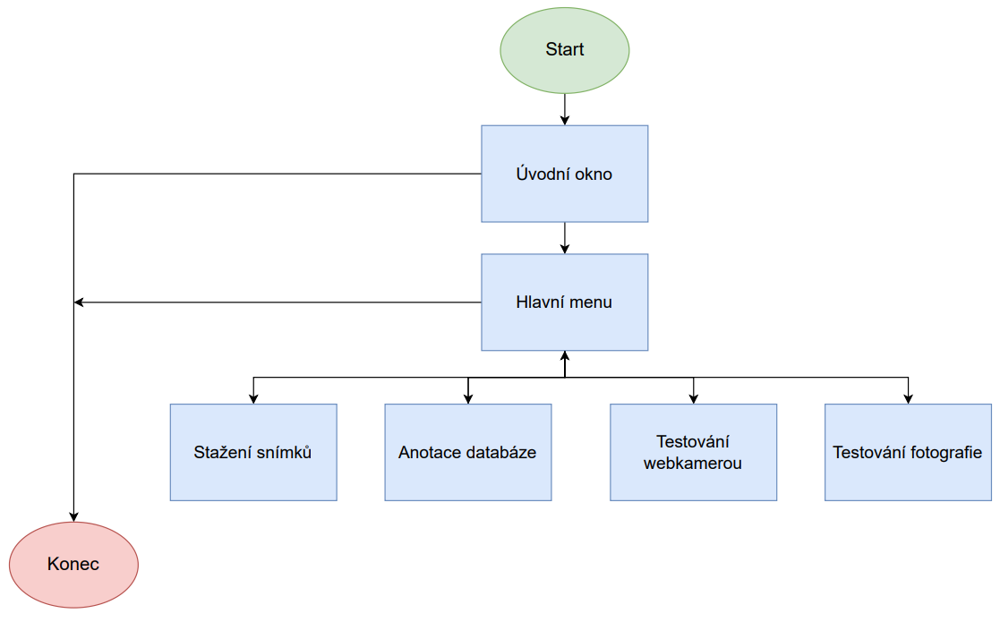
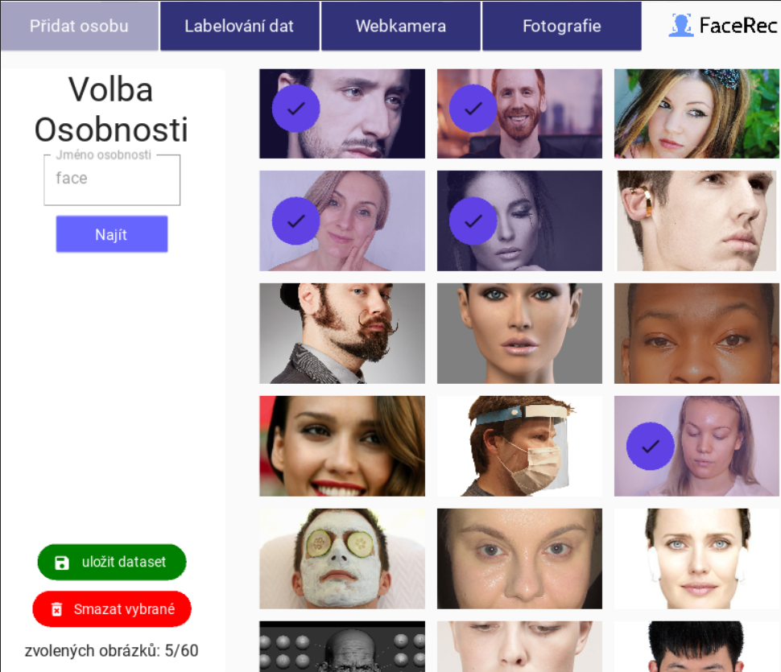
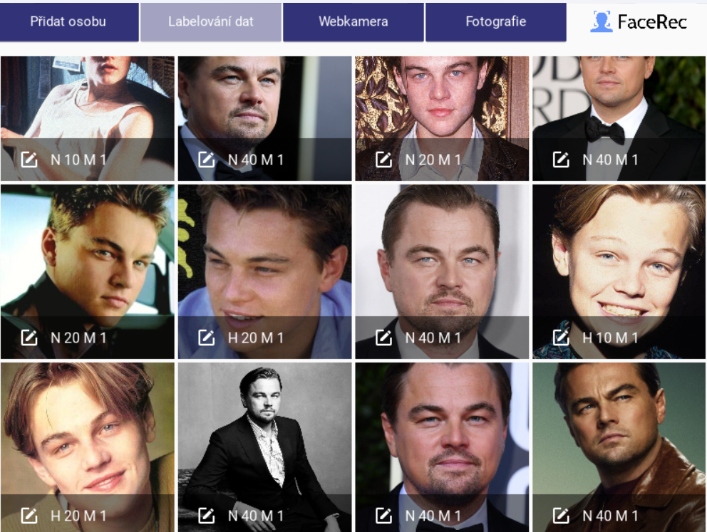
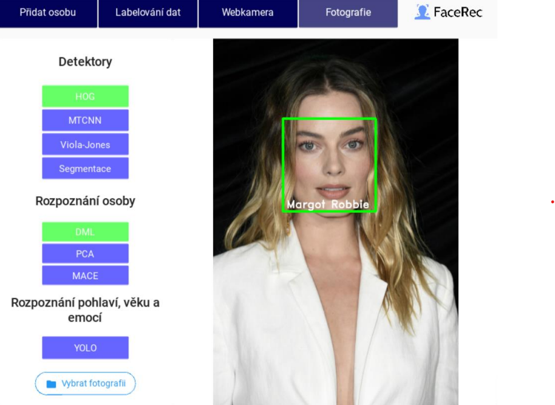

# Systém Face_Rec 

Aplikace slouží pro tvorbu databáze fotografií osob s nástroji pro stažení a labelování dat. Následně je možné v aplikaci tyto data otestovat na metody strojového učení, zaměřené na detekci obličeje, rozpoznání osob a jejich pohlaví, věku a emocí.

## Analýza cílové skupiny

- Machine Learning Researcher
- Data analytik

**Předpokládané vzdělaní:** vysokoškolské  
**Zaměření:** IT, strojové učení  

# Struktura dokumentace

## 1. Úvod do projektu
Tato práce se skládá ze 3 hlavních komponent:
  - Databáze
  - Aplikace
  - Analýza testování
  
Před začátkem je velmi doporučena instalace veškerých knihoven. Tyto knihovny lze získat stažením projektu a příkazem pip: -r requirements.txt
 
## 2. Databáze
databáze obsahuje 100 slavných osobností zastoupena 50 různými snímky. Ohraničení oblasti obličeje probíhalo poloautomatickou formou s využitím algoritmu HOG, zbylé kategorie byly stanoveny prostřednictvím vytvořené aplikace. Pro uložení anotací k snímkům byl zvolen formát JSON s následující strukturou:
- "name": jméno
- "age": 10 | 20 | 30 | 40 | 50 | 60 | 70
- "gender": "F" | "M"
- "emotion": "S" | "H" | "N"  | "A" |
- "faceloc" = [x1, y1, y2, x2] ((levý horní roh), (pravý spodní roh))

## 3. Použité metody
### metody detekce osob
- Segmentace (vlastní implementace)
- Viola-Jones (OpenCV)
- MTCNN (OpenCV)
- HOG (DLIB)
### metody rozpoznání osob
- PCA (vlasní implementace + Scipy)
- Korelační filtr MACE (vlastní implementace)
- Deep metric learning (knihovna Face_recognition implementující resnet-34 architekturu DLIB)
### metody rozpoznání emocí, pohlaví a věku
- YOLO v7 (použita [implementace](https://github.com/WongKinYiu/yolov7))
- Vlastní neuronové sítě
  - 2x konvoluční vrstva
  - modifikace Resnet-8
  - modifikace VGG7BN
## 4. Aplikace Face_Rec

Aplikaci lze spustit napsáním příkazu python3 main.py v přikazovém řádku.

### vývojový diagram
 
### funkcionalita

- Stažení snímků do databáze

Zadáním jména osobnosti do textového pole je staženo $n$ fotografií dané osoby s možností zvolit, které snímky si uživatel přeje uložit do své databáze.

- Anotace dat

Tato část se dělí na tři samostatná podokna. V prvním podokně je možnost volby osobnosti, kterou si uživatel přeje upravit. Následně jsou zobrazeny všechny fotografie dané osoby včetně anotací, pokud jsou již přiřazeny. Poslední podokno je věnováno samotnému upravení anotací snímku (věku, pohlaví a emoci), včetně zobrazení plochy ohraničující obličej.

- Vizuální testování na libovolné fotografii

Umožňuje vybrat libovolnou fotografii z adresářové struktury a stejně jako v okně s webkamerou je možné vizuálně otestovat vybrané algoritmy.

- Vizuální testování webkamerou

V případě připojené videokamery je možné otestovat vybrané metody v reálném čase. Obraz je aktualizován s obnovovací frekvencí 30 snímků za vteřinu. Pro zrychlení chodu aplikace probíhá, v případě aktivace jedné z rozpoznávacích metod, identifikace každé tři vteřiny.

# Pivo

## 1) Koncept

Otvírak slouží k otevření nápojů s kovovými zátkami.

## 2) Pracovní postup

+ Pevně uchopte láhev svou slabší rukou těšně pod uzávěrem
+ Do druhé ruky si vezměte otvírák
+ Konec otvíráku zapřete mezi ukazováček a zátku
+ Poté pákou zatlačte otvírákem směrem dolů
+ Tímto by mělo dojít k otevření láhve

## 3) Reference

### Otvírák
kovový otvírák střední velikost

### Kroužek

slouží pro připojení úchytného zařízení

###  kovová svorka

svorka sloužící na připojení ke kusu oblečení, zabraňující ztrátě

## 4) Katalogový list

rozměry: 5, 4 × 1 cm
hmotnost (kg): 0,01
materiál: hliník
údržba: vhodný do myčky
záruka: 2 roky

## 5) Tuturiál

Při prvním užití je vhodné připojení otvíráku ke svorce. Následně je možné přistoupit k prvnímu otevření láhve. Poté uchopíme otvírák do ruky a přiložíme pod úhlem 45 stupňů k láhvy. Páčivým pohybem směrem dolů od láhve lze oddělit uzávěr od láhve.

# Skládání PC

## Zapojení PC
- Počítač položíme na pevné, vodorovné místo v otevřeném prostoru
- Přiložený zdrojový kabel zapojíme do konektoru a druhým koncem do elektrické sítě 230V
- Přepínač umístěný vedle konektoru přesuneme do polohy "on" (znak | ) 

## Zapojení periferií
### Monitor
- V obalu přiložený HDMI kabel připojíme jedním koncem do základní desky a druhým do monitoru (je nutné dá si pozor aby nedošlo k zapojení do grafické karty)
- Monitor následně připojte zdrojovým kabelem do elektrické sítě 230V
### Klávesnice
- Klávesnice je zapojena kabelem do USB konektoru základní desky
### Bezdrátová myš
- Ze spodní strany myšy je nutné páčivým pohybem odstranit krytku baterie
- Pod krytem je umístěn bezdrátový přijímač, který umístětě do USB konektoru počítače 
- V obalu myšy naleznete 1,5V baterii která je potřeba vložit do místa pod krytkou
- Na baterii vidíte na koncích značku "+" a "-", vložte baterii na místo se shodujícími se znaky v místě po otevření krytu
- Kryt vratťe na původní místo

# Windows
- Stisknetě tlačítko Power
- Pokud uvídítě podsvícení obrazovky monitoru je připojení v pořádku (V opačném případě překontroluje postup zmíněný výše, pokud problém přetrvává, pokračujte do sekce "Časté chyby"
- Po cca 20 vteřinách by jste měli uvidět úvodní obrazovku Windows
- Budete vyzván k vyplnění uživatelských informací
- Následně proběhne úvodní nastavení systému (trvající několik minut)
- Pokud je po proběhutí nastavení zobrazena plocha operačního systému Windows, považujte tento návod za splněný
