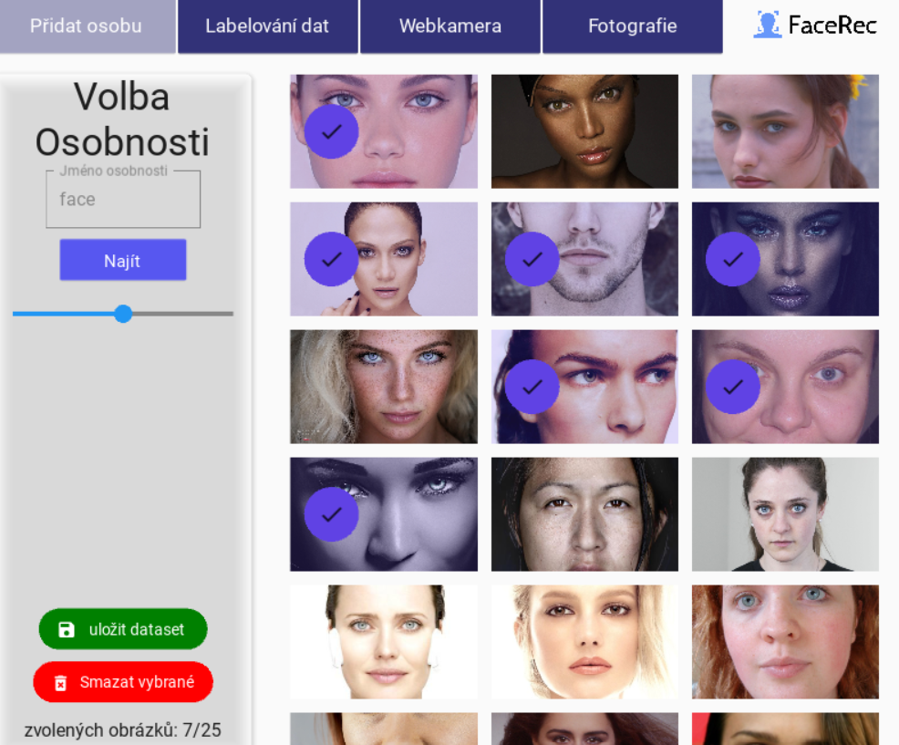

# Systém Face_Rec 

Aplikace slouží pro tvorbu databáze fotografií osob s nástroji pro stažení a labelování dat. Následně je možné v aplikaci tyto data otestovat na metody strojového učení, zaměřené na detekci obličeje, rozpoznání osob a jejich pohlaví, věku a emocí.

## Analýza cílové skupiny

- Machine Learning Researcher
- Data analytik

**Předpokládané vzdělaní:** vysokoškolské  
**Zaměření:** IT, strojové učení  

# Struktura dokumentace

## 1. Úvod do projektu
Tato práce se skládá ze 3 hlavních komponent:
  - Databáze
  - Aplikace
  - Analýza testování
  
Před začátkem je velmi doporučena instalace veškerých knihoven. Je přiložen import virtuálního prostředí v adresáři /virtual_env/env_data_science.yml.Tento soubor lze importovat v prostředí Anaconda (spustit Anaconda -> prostředí -> import -> zvolit .yml soubor. Bohužel knihovny DLIB a face_recognition vyžadují samostatnou instalaci (včetně Visual studia). Dále je třeba do adresáře yolo/ umístit yolov7 imeplementaci: https://github.com/WongKinYiu/yolov7 , v které jsou obsaženy podpůrné programy pro spouštění YOLO detektoru. V případě jakéhokoliv problému se spuštěním neváhejte kontaktovat na email: jan.podavka@tul.cz
 
## 2. Databáze

Databáze obsahuje 100 slavných osobností zastoupena 50 různými snímky. Ohraničení oblasti obličeje probíhalo poloautomatickou formou s využitím algoritmu HOG, zbylé kategorie byly stanoveny prostřednictvím vytvořené aplikace. Databáze je uložena /data/data.json s následující strukturou:
- "name": jméno
- "age": 10 | 20 | 30 | 40 | 50 | 60 | 70
- "gender": "F" | "M"
- "emotion": "S" | "H" | "N"  | "A" |
- "faceloc" = [x1, y1, y2, x2] ((levý horní roh), (pravý spodní roh))
- "path" = "osobnost/jmeno/img"

Příklad uložení 1 osoby:

## 3. Použité metody
### Metody detekce osob
- Segmentace (vlastní implementace)
- Viola-Jones (OpenCV)
- MTCNN (OpenCV)
- HOG (DLIB)
### Metody rozpoznání osob
- PCA (vlasní implementace + Scipy)
- Korelační filtr MACE (vlastní implementace)
- Deep metric learning (knihovna Face_recognition implementující resnet-34 architekturu DLIB)
### Metody rozpoznání emocí, pohlaví a věku
- YOLO v7 (použita [implementace](https://github.com/WongKinYiu/yolov7))
- Vlastní neuronové sítě
  - MLP
  - 2x konvoluční vrstva
  - modifikace Resnet-8
  - modifikace VGG7BN
## 4. Aplikace Face_Rec

Aplikaci lze spustit napsáním příkazu python3 main.py v přikazovém řádku.

### Vývojový diagram
 
### Funkcionalita

#### Stažení snímků do databáze

- Toto okno slouží pro stažení snímků a následné uložení snímku do databáze
- Zadáním klíče (jména) do textového pole a stisknutím tlačítka najít je staženo n snímku do adresáře Osobnost/jméno
- Počet stažených snímku je volen posuvníkem, který je limitován intervalem [0, 50]
- Následně je nabídnuta možnost zvolení snímků, které si uživatel nepřeje uložit do své databáze. Jejich označením a stiskem tlačítka Smazat vybrané dojde k jejich odstraněné.
- Tlačítkem Uložit dataset jsou veškeré nadále zobrazené fotografie uloženy do databáze ve formátu JSON a inicializovány prázdné anotace.

####  Anotace dat

Tato část se dělí na tři samostatná podokna. V prvním podokně je možnost volby osobnosti, kterou si uživatel přeje upravit. Následně jsou zobrazeny všechny fotografie dané osoby včetně anotací, pokud jsou již přiřazeny. Poslední podokno je věnováno samotnému upravení anotací snímku (věku, pohlaví a emoci), včetně zobrazení plochy ohraničující obličej.

####  Vizuální testování na libovolné fotografii

Stiskem tlačítka Vybrat fotografii je zobrazena možnost vybrat libovolnou fotografii nacházející se v paměti zařízení. je nutné dodržet několik pravidel,
v opačném případě aplikace nespustí požadovanou metodu:

- pro identifikaci osob platí, že není možná aktivace více metod současně a je vyžadováno využité jedné či více detekčních metod
- pro spuštění YOLO metod je nutné mít neaktvivní všechny ostatní (a nelze spustit více současně)

####  Vizuální testování webkamerou

V případě připojené videokamery je možné otestovat vybrané metody v reálném čase. Obraz je aktualizován s obnovovací frekvencí 30 snímků za vteřinu. Pro zrychlení chodu aplikace probíhá, v případě aktivace jedné z rozpoznávacích metod, identifikace každé 3 vteřiny. Jinak je princip stejný jako testování na fotografii.

## 5. Popis zbývajících souborů

- kivy_screens: obsahuje front-end soubory pro tvorbu github
- plotting_methos: pomocné programy, které byly využity při tvorbě dokumentace
- data: je zde uložena struktura JSON s databázi a detekční soubory
- data_analysis: soubory s výsledky testování
- yolo: v yolo/yolov7 se nachází implementace yolov7, v yolo/weights jsou natrénované váhy detektoru
- own_cnn.ipynb: Zde je vytvořený program v jupyter notebooku pro testování neuronových sítí na databázi

